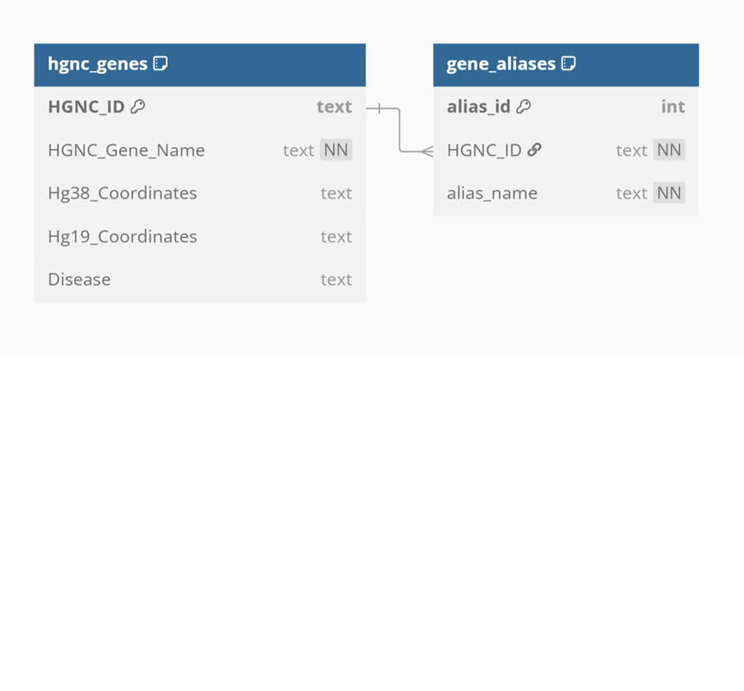

# hgnc-retrieval-utils
Collection of modules for retrieving metadata for HGNC.


## Install

Please see the [INSTALL](docs/INSTALL.md) instructions.

## Sample invocation

```shell
 python main.py --pmid 38790019 --verbose
--config_file was not specified and therefore was set to 'conf/config.yaml'
--outdir was not specified and therefore was set to '/tmp/sundaram/bg-retrieval-utils/main/2025-04-18-152719'
Created output directory '/tmp/sundaram/bg-retrieval-utils/main/2025-04-18-152719'
--logfile was not specified and therefore was set to '/tmp/sundaram/bg-retrieval-utils/main/2025-04-18-152719/main.log'
--outfile was not specified and therefore was set to '/tmp/sundaram/bg-retrieval-utils/main/2025-04-18-152719/38790019_gene_metadata.csv'
Data saved to /tmp/sundaram/bg-retrieval-utils/main/2025-04-18-152719/38790019_gene_metadata.csv
Execution of '/home/sundaram/bg/projects/hgnc-retrieval-utils/main.py' completed
```

## Retrieve metadata


Here are the contents of the comma-separated file:


```shell
cat /tmp/sundaram/bg-retrieval-utils/main/2025-04-18-152719/38790019_gene_metadata.csv
HGNC_ID,HGNC_Gene_Name,Gene_Aliases,Hg38_Coordinates,Hg19_Coordinates,Disease
HGNC:1100,BRCA1 DNA repair associated,"RNF53,BRCC1,PPP1R53,FANCS",17:43044295-43170245,17:43044295-43170245,N/A
HGNC:11998,tumor protein p53,"p53,LFS1",17:7661779-7687546,17:7661779-7687546,N/A
HGNC:3236,epidermal growth factor receptor,"ERBB1,ERRP",7:55019017-55211628,7:55019017-55211628,N/A
HGNC:9588,phosphatase and tensin homolog,"MMAC1,TEP1,PTEN1",10:87862638-87971930,10:87862638-87971930,N/A
HGNC:391,AKT serine/threonine kinase 1,"RAC,PKB,PRKBA,AKT,RAC-alpha",14:104769349-104795759,14:104769349-104795759,N/A
```

## Invocation without required parameters

Currently, only the `--pmid` is required.
If not provided, the program will print the help screen:

```shell
 python main.py
--pmid was not specified
Exiting because of errors
Usage: main.py [OPTIONS]

  Retrieve gene info for PMID.

Options:
  --config_file PATH  The configuration file for this project - default is
                      'conf/config.yaml'
  --infile TEXT       The primary input file
  --logfile TEXT      The log file
  --outdir TEXT       The default is the current working directory - default
                      is '/tmp/sundaram/bg-retrieval-
                      utils/main/2025-04-18-153127'
  --outfile TEXT      The output final report file
  --pmid TEXT         The PMID for which gene metadata should be retrieved.
  --verbose           Will print more info to STDOUT - default is 'False'.
  --help              Show this message and exit.
```


If you run `python main.py --help` the usage info will be display:


```shell
python main.py --help                   
Usage: main.py [OPTIONS]

  Retrieve gene info for PMID.

Options:
  --config_file PATH  The configuration file for this project - default is
                      'conf/config.yaml'
  --infile TEXT       The primary input file
  --logfile TEXT      The log file
  --outdir TEXT       The default is the current working directory - default
                      is '/tmp/sundaram/bg-retrieval-
                      utils/main/2025-04-18-153238'
  --outfile TEXT      The output final report file
  --pmid TEXT         The PMID for which gene metadata should be retrieved.
  --verbose           Will print more info to STDOUT - default is 'False'.
  --help              Show this message and exit.
```

## Database Schema

Please see the database schema for SQLite [here](database/create_table.sqlite.ddl.sql).<br>
Please see the database schema for MySQL [here](database/create_table.mysql.ddl.sql).<br>

## Schema Diagram

Here is the mocked schema in dbdiagram.io:<br>
<br>



## Query results

1. HGNC ID and disease connection

```sql
sqlite3 gene_database.db                   
SQLite version 3.45.1 2024-01-30 16:01:20
Enter ".help" for usage hints.
sqlite> select hg.HGNC_ID, hg.Disease
from hgnc_genes hg;
HGNC:1100|
HGNC:11998|
HGNC:3236|
HGNC:9588|
HGNC:391|
sqlite> 
```

2. HGNC Gene Name and any gene name aliases parsed

```sql
sqlite> select hg.HGNC_Gene_Name, ga.alias_name
from hgnc_genes hg
join gene_aliases ga on hg.HGNC_ID = ga.HGNC_ID
order by hg.HGNC_Gene_Name, ga.alias_name;
AKT serine/threonine kinase 1|AKT
AKT serine/threonine kinase 1|PKB
AKT serine/threonine kinase 1|PRKBA
AKT serine/threonine kinase 1|RAC
AKT serine/threonine kinase 1|RAC-alpha
BRCA1 DNA repair associated|BRCC1
BRCA1 DNA repair associated|FANCS
BRCA1 DNA repair associated|PPP1R53
BRCA1 DNA repair associated|RNF53
epidermal growth factor receptor|ERBB1
epidermal growth factor receptor|ERRP
phosphatase and tensin homolog|MMAC1
phosphatase and tensin homolog|PTEN1
phosphatase and tensin homolog|TEP1
tumor protein p53|LFS1
tumor protein p53|p53
```


## TODO

Please see the [TODO](docs/TODO.md) for planned improvements.

## Contact

Please send inquiries to Jay Sundaram.